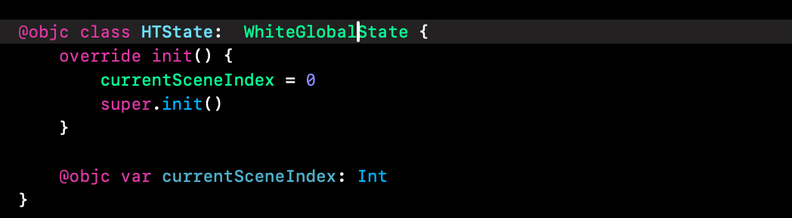
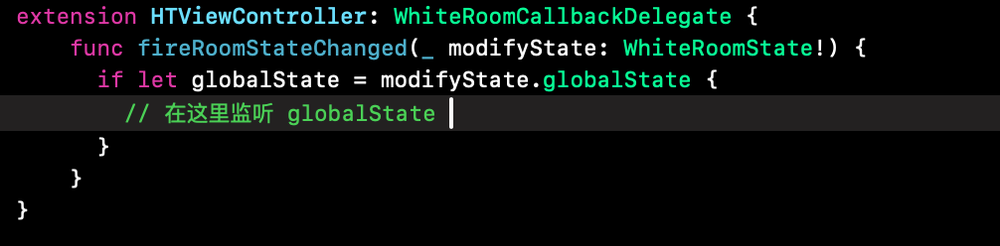
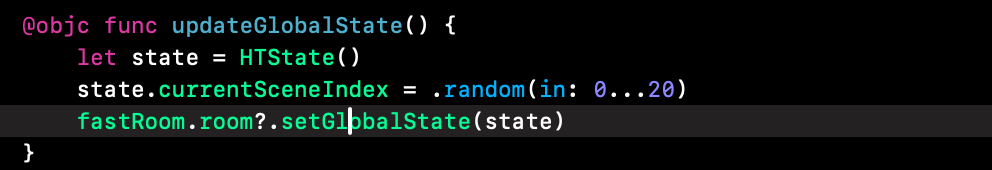

1. 声明你的数据类型，注意需要继承自 `WhiteGlobalState` 并且要标注 `@objc`

   
2. 设置类型。需要在加入房间之前调用。

   ```
   WhiteDisplayerState.setCustomGlobalStateClass(HTState.self)
   ```
3. 设置监听。

   ```
   fastRoom.roomDelegate = self
   ```



4. 主动设置。
   
5. 主动查看。

   
