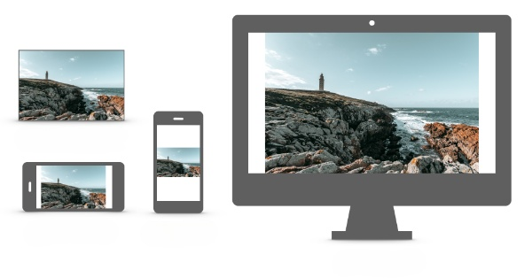

# 如何设置白板比例
白板会保证所有房间内所有人看到的内容是一样的。

在确定白板比例之前，你需要先确定一下你的白板将在哪里被展示，展示什么内容。

这里有两种可能：

## 1. 在各种设备上尽可能的占满屏幕

你的产品是跨端跨设备的，可能有平板，手机，横屏手机，并且里面的内容形式不确定。

你希望尽可能的利用当前屏幕的可用区域。类似这样:

为了平衡所有设备的展示效果，推荐你选择16:9的比例，也就是Fastboard默认的设置比例，不需要额外写代码。

你可以通过调整视图上其他元素的位置来让你的`FastRoomView`保持16:9的比例。

我们的一个开源教学产品 Flat 有类似的布局代码，它通过调整屏幕内视频和白板位置来达到屏幕高利用率，具体代码可以参考[这里](https://github.com/vince-hz/flat-ios/blob/main/Flat/Modules/ClassRoom/ViewController/ClassRoomLayout.swift)

## 2. 固定样式

你的白板样式是固定的，你只想展示一个指定比例的可用区域。

举个例子，你现在希望无论在哪个端，房间内用户看到的都是一个正方形。

这时候你应该修改 `Fastboard.globalFastboardRatio` 为你想要的 1 : 1。